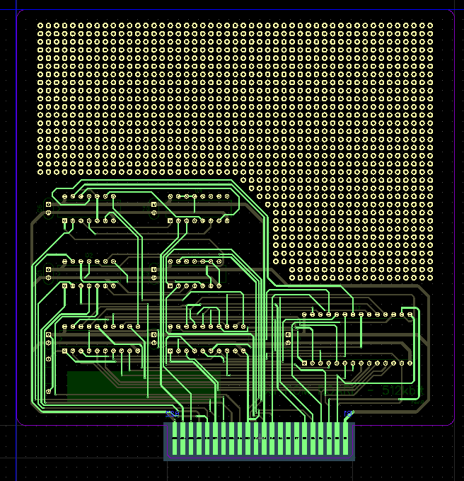

# Sharp X1 ROM Board

##Whats?
Sharp X1 PC (CZ-800 series) add-in ROM board as [CZ-8RB01](https://www.google.co.jp/search?q=CZ-8RB01) clone.

Of course, "I think" that programs other than HuBASIC can also be started.

##Schematic

[BasicRom_rev0c.pdf](BasicRom_rev0c.pdf)

##BOM

| REFERENCE | PARTS | QTY | Digikey P/N |
|:-----------:|:------------:|:------------:|:------------:|
|C1,C2,C3,C4,C5,C6,C7| 0.1uF MLCC | 7 | [K104K15X7RF53L2](https://www.digikey.jp/product-detail/ja/vishay-bc-components/K104K15X7RF53L2/BC3324-ND/2820506)|
|R1| zero-ohm or wire | 1 | any |
|U1| 74LS10 | 1 | [SN74LS10N](https://www.digikey.jp/product-detail/ja/texas-instruments/SN74LS10N/296-1634-5-ND/277280) |
|U2| 74LS27 | 1 | [SN74LS27N](https://www.digikey.jp/product-detail/ja/texas-instruments/SN74LS27N/296-14890-5-ND/563028) |
|U3 | 74LS32 | 1 | [SN74LS32N](https://www.digikey.jp/product-detail/ja/texas-instruments/SN74LS32N/296-1658-5-ND/277304) |
|U4 | 74LS139 | 1 | [SN74LS139AN](https://www.digikey.jp/product-detail/ja/texas-instruments/SN74LS139AN/296-1640-5-ND/277286) |
|U5, U6 |  74LS273 |2| [SN74LS273N](https://www.digikey.jp/product-detail/ja/texas-instruments/SN74LS273N/296-1657-5-ND/277303) |
|U7|  27C512 | 1| [AT27C512R-45PU](https://www.digikey.jp/product-detail/ja/microchip-technology/AT27C512R-45PU/AT27C512R-45PU-ND/1118862) |

Note: AT27C512R-45PU is OTP (one-time programmable) ROM.

##PCB

TOP

BOTTOM

##Correction of PCB

Bottom side, cut "RESET" signal.

##Address decoder simulation

Attached Tina simulation file.

##Design Environment
DipTrace 3.0.0.2  (<http://diptrace.com/>)

TINA11 Industrial  (<https://www.tina.com/>)
